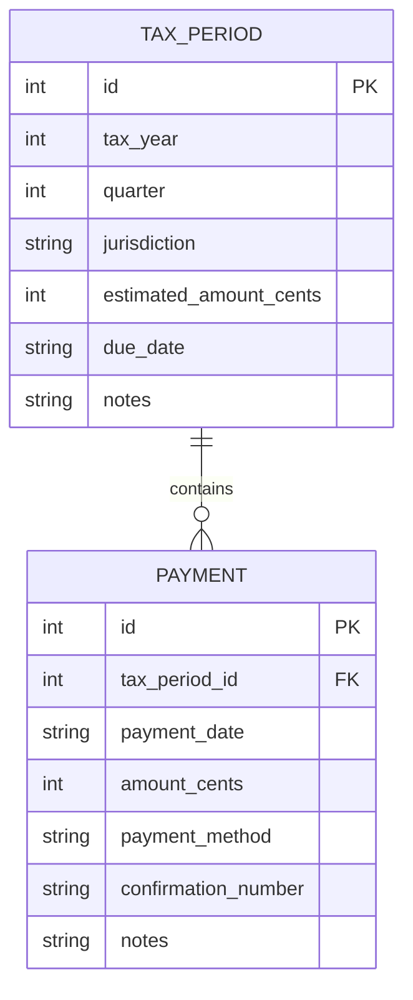

# Tax Payment Tracking System

> Portfolio reconstruction and engineering extension of a verified Spring 2024 CSIT 555 team project: a tax-payment tracking system built around Flask, MySQL, Docker Compose, CRUD workflows, and reporting services.

[](https://perpsakach.github.io/)


## Historical project verification

This project is grounded in the original **CSIT 555_01 SP24 — Database Systems** final-project documentation submitted on April 27, 2024.

The document identifies **Final Project: Group 5** and lists six team members:

- Dianah Mutanda
- Michael Gluck
- Noah Mengich
- **Perps Ndiege**
- Sarah Bober
- Sarmad Sohail

The team report links the original public repository:

**https://github.com/migluck/csit555final**

The historical report describes a tax and payment tracking system with a web UI, database-backed records, quarterly estimated-tax tracking, CRUD operations, payment/reporting controllers, and local web endpoints.

### Attribution boundary

This repository does **not** claim that I individually authored every component of the original group system. The historical evidence establishes my membership in the six-person project team, while the original Git commit metadata visible today primarily identifies other team accounts. Accordingly, this portfolio version distinguishes team-level historical facts from the current implementation work in this repository.

## Historical architecture

Repository history for the original team project shows a containerized architecture that evolved during development. At its fuller stage it included Flask services, MySQL persistence, Docker Compose, payment-record handling, reporting/web presentation, and service-to-service HTTP communication. Earlier history also includes an Nginx reverse-proxy design.

The historical project therefore remains useful as a database-systems and service-integration case study rather than being presented as the same implementation as the code in this repository.

## Historical functionality recovered

From the original report and repository history, the team project demonstrably included or worked toward:

- Flask-based web services
- MySQL relational persistence
- Docker and Docker Compose
- payment-record management
- reporting/web presentation
- service-to-service HTTP communication
- CRUD operations
- database schema and indexes
- quarterly tax-payment tracking
- filtering and tax-summary UI behavior
- health/service endpoints during container development

The original report describes quarterly estimated-tax due dates of April 15, June 15, September 15, and January 15 of the following year. This portfolio does not treat those dates as universal tax advice; they are documented historical project requirements.

## Current portfolio implementation

The code in **this repository** is a compact reconstruction of the same domain, designed to be easy to run and inspect.

The current implementation actually provides:

- Flask application factory
- local SQLite persistence
- `TaxPeriod` → `Payment` parent-child relational model
- multiple payments per tracked tax period
- integer-cent monetary storage
- `Decimal` parsing and cent rounding at input boundaries
- user-entered due dates
- derived remaining-balance and status logic
- database constraints for quarter, monetary values, foreign keys, and unique period/jurisdiction combinations
- JSON API endpoints for health, tax-period creation/listing, and payment creation
- focused unit tests for money conversion, partial-payment status, overdue status, and non-negative remaining balance

The current code does **not** presently implement the historical web UI, full CRUD surface, annual reporting, CSV export, Docker Compose runtime, MySQL runtime, or separate reporting/payment microservices.

That distinction is intentional: historical capabilities are documented as **RECOVERED team-project evidence**, while current code capabilities are documented only when they are actually present in this repository.

## Current domain model



Separating `TaxPeriod` from `Payment` allows one tracked quarterly obligation to contain multiple payment transactions instead of forcing one row to represent both the obligation and its payment history.

## Current API scope

### Health

```http
GET /api/health
```

Returns a simple application-health response.

### Create a tax period

```http
POST /api/periods
Content-Type: application/json
```

Example:

```json
{
  "tax_year": 2026,
  "quarter": 2,
  "jurisdiction": "Federal",
  "estimated_amount": "1250.00",
  "due_date": "2026-06-15",
  "notes": "Example tracked obligation"
}
```

### List tax periods

```http
GET /api/periods
```

The response derives `paid_cents`, `remaining_cents`, and the current status from recorded payments and the user-entered due date.

### Add a payment

```http
POST /api/periods/<period_id>/payments
Content-Type: application/json
```

Example:

```json
{
  "amount": "500.00",
  "payment_date": "2026-05-30",
  "payment_method": "ACH",
  "confirmation_number": "EXAMPLE-001"
}
```

## Money handling

Financial amounts are persisted as integer cents instead of binary floating-point values:

```text
$1,234.56 -> 123456 cents
```

User-facing values are parsed with Python `Decimal` and explicitly rounded to cent precision before persistence.

## Status logic

Let:

```text
E = tracked estimated obligation
P = sum of recorded payments
R = max(0, E - P)
```

The current service logic reports:

```text
E = 0                          -> NO AMOUNT TRACKED
R = 0                          -> PAID
R > 0 and due date has passed -> OVERDUE
0 < P < E before due date     -> PARTIALLY PAID
P = 0 before due date         -> UNPAID
```

`OVERDUE` only means the **user-entered tracked due date has passed with a remaining balance**. It is not a legal determination of penalty, delinquency, or tax-authority treatment.

## Current repository structure

```text
.
├── app/
│   ├── __init__.py      # Flask routes and application factory
│   ├── db.py            # SQLite schema and transaction helper
│   ├── money.py         # Decimal/integer-cent utilities
│   └── services.py      # status and remaining-balance logic
├── docs/
│   └── HISTORICAL_PROJECT.md
├── tests/
│   └── test_services.py
├── PROVENANCE.md
├── README.md
├── requirements.txt
└── run.py
```

## Run locally

```bash
python -m pip install -r requirements.txt
python run.py
```

By default, the SQLite database is created under Flask's instance directory. Set `DATABASE_PATH` to override it.

## Tests

The repository currently contains focused service-level tests. They cover:

- dollar-to-cent conversion
- partial-payment status
- overdue status
- remaining-balance floor at zero

Run with:

```bash
pytest -q
```

The presence of tests is documented here; a passing CI/runtime claim should only be made when execution has been verified in that environment.

## Scope boundary

The current portfolio implementation does **not**:

- calculate legally correct federal or state tax liability
- file tax returns
- transmit tax payments
- connect directly to the IRS or a state tax authority
- calculate penalties or safe-harbor rules
- provide a production tax-advice workflow

It tracks user-entered obligations and payment records.

## What this project demonstrates

### Historical team project

- collaborative database-systems development
- Flask application/service development
- MySQL relational persistence
- Docker / Docker Compose
- service integration over HTTP
- CRUD and reporting workflows
- web UI and database integration

### Current reconstruction

- provenance-aware reconstruction
- parent-child relational modeling
- cent-accurate monetary representation
- Flask JSON API design
- SQLite persistence and constraints
- validation and payment-status logic
- focused unit testing

## Provenance

This repository uses four evidence labels:

- **RECOVERED** — supported by the original 2024 Group 5 report and/or original GitHub history
- **RECONSTRUCTED** — current code rebuilt from the verified project domain and requirements where original source attribution is not individual-specific
- **ENHANCED** — modern improvements added in this portfolio repository
- **UNVERIFIED** — any individual contribution claim not directly supported by available evidence

See [`PROVENANCE.md`](PROVENANCE.md) and [`docs/HISTORICAL_PROJECT.md`](docs/HISTORICAL_PROJECT.md).

## Portfolio

Explore the complete technical portfolio at **[perpsakach.github.io](https://perpsakach.github.io/)**.
