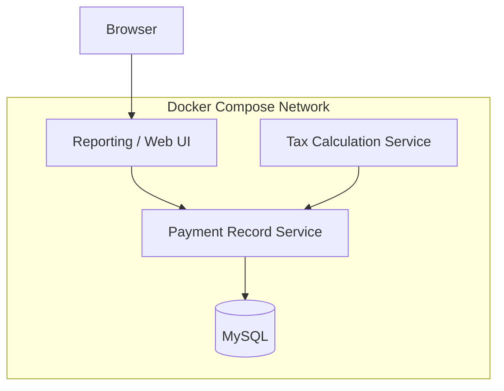
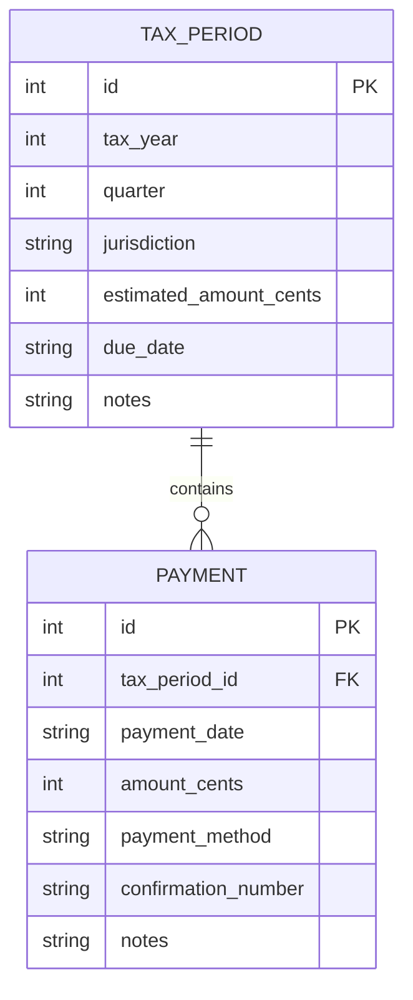
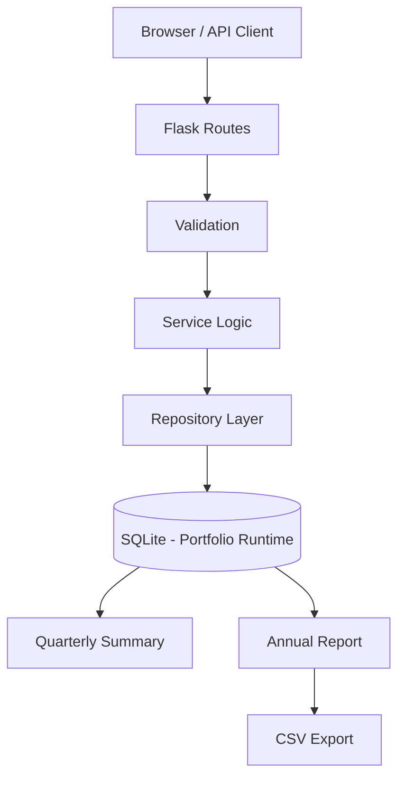

# Tax Payment Tracking System

> Portfolio reconstruction and engineering extension of a verified Spring 2024 CSIT 555 team project: a tax-payment tracking system built around Flask, MySQL, Docker Compose, CRUD workflows, and reporting services.

[](https://perpsakach.github.io/)


## Historical project verification

This project is now grounded in the original **CSIT 555_01 SP24 — Database Systems** final-project documentation submitted on April 27, 2024.

The document identifies **Final Project: Group 5** and lists six team members:

- Dianah Mutanda
- Michael Gluck
- Noah Mengich
- **Perps Ndiege**
- Sarah Bober
- Sarmad Sohail

The team report links the original public repository:

**https://github.com/migluck/csit555final**

The historical report describes a tax and payment tracking system with a web UI, database-backed records, quarterly estimated-tax tracking, CRUD operations, payment/reporting controllers, and local web endpoints.

### Attribution boundary

This repository does **not** claim that I individually authored every component of the original group system. The historical evidence establishes my membership in the six-person project team, while the original Git commit metadata visible today primarily identifies other team accounts. Accordingly, this portfolio version distinguishes team-level historical facts from the current implementation work in this repository.

## Historical architecture

Repository history for the original team project shows a containerized architecture that evolved during development. At its fuller stage it included:



The original development history also contains an earlier Nginx reverse-proxy design and later simplification/integration work. This makes the historical project useful as a database-systems and service-integration case study rather than merely a single-file CRUD application.

## Historical functionality recovered

From the original report and repository history, the team project demonstrably included or worked toward:

- Flask-based web services
- MySQL relational persistence
- Docker and Docker Compose
- payment-record management
- reporting/web presentation
- service-to-service HTTP communication
- CRUD operations: create, read, update, delete
- database schema and indexes
- quarterly tax-payment record tracking
- filtering and tax-summary UI behavior
- health/service endpoints during container development

The original report describes quarterly estimated tax due dates of April 15, June 15, September 15, and January 15 of the following year. This portfolio does not treat those dates as universal tax advice; they are documented historical project requirements.

## Current portfolio implementation

The code in **this repository** is an enhanced reconstruction designed to preserve the original domain while improving several engineering decisions.

The current implementation uses Flask with a local SQLite persistence layer for portability and adds:

- explicit `TaxPeriod` → `Payment` parent-child modeling
- multiple partial payments per tracked period
- integer-cent monetary storage instead of binary floating point
- `Decimal` parsing at input boundaries
- user-entered due dates rather than hard-coded legal assumptions
- derived payment-status summaries
- annual reporting and CSV export
- database constraints and validation
- testable service logic

This means the repository intentionally has two layers of provenance:

```text
2024 VERIFIED TEAM PROJECT
Flask + MySQL + Docker Compose + CRUD + reporting/services
                    ↓
CURRENT PORTFOLIO RECONSTRUCTION
Flask + portable SQLite + stronger domain model + safer money handling + tests/reporting
```

## Current domain model



Separating `TaxPeriod` from `Payment` allows one quarterly obligation to be represented by multiple partial payment transactions instead of forcing one database row to represent both the obligation and its payment history.

## Current architecture



The historical project used MySQL and Docker Compose. SQLite is used here to make the portfolio implementation easy to run locally; it is an **enhancement/reconstruction choice**, not a claim about the historical database.

## Money handling improvement

The historical SQL schema used floating-point storage for `amount`. The portfolio reconstruction instead stores financial values as integer cents:

```text
$1,234.56 -> 123456 cents
```

User-facing amounts are parsed with Python `Decimal` and rounded explicitly to cent precision before persistence.

## Status logic

Let:

```text
E = tracked estimated obligation
P = sum of recorded payments
R = max(0, E - P)
```

Then:

```text
R = 0                          -> PAID
0 < P < E and before due date -> PARTIALLY PAID
P = 0 and before due date     -> UNPAID
R > 0 and after due date      -> OVERDUE
```

`OVERDUE` only means the **user-entered tracked due date has passed with a remaining balance**. It is not a legal determination of penalty, delinquency, or tax-authority treatment.

## Current API / route scope

The present portfolio code exposes a compact Flask interface around tax periods and payments. The repository is intentionally positioned as a tracking and record-management application, not a tax-filing engine.

## Scope boundary

The portfolio implementation does **not**:

- calculate legally correct federal or state tax liability
- file tax returns
- transmit tax payments
- connect directly to the IRS or a state tax authority
- calculate penalties or safe-harbor rules

It tracks user-entered obligations and payment records.

## What this project demonstrates

### Historical team project

- collaborative database-systems development
- Flask application/service development
- MySQL relational persistence
- Docker / Docker Compose
- service integration over HTTP
- CRUD and reporting workflows
- web UI and database integration

### Current engineering extension

- provenance-aware reconstruction
- parent-child relational modeling
- cent-accurate financial arithmetic
- validation and status logic
- portable development persistence
- reporting and CSV output
- testable service-layer design

## Provenance

This repository uses four evidence labels:

- **RECOVERED** — supported by the original 2024 Group 5 report and/or original GitHub history
- **RECONSTRUCTED** — current code rebuilt from the verified project domain and requirements where original source attribution is not individual-specific
- **ENHANCED** — modern improvements added in this portfolio repository
- **UNVERIFIED** — any individual contribution claim not directly supported by available evidence

See [`PROVENANCE.md`](PROVENANCE.md) and [`docs/HISTORICAL_PROJECT.md`](docs/HISTORICAL_PROJECT.md).

## Portfolio

Explore the complete technical portfolio at **[perpsakach.github.io](https://perpsakach.github.io/)**.