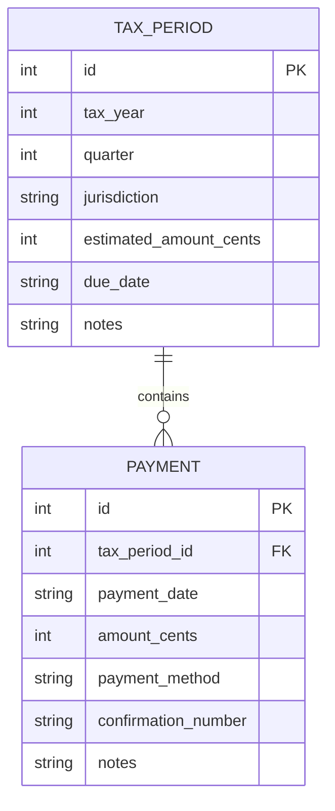
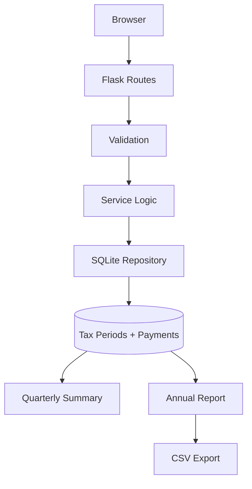

# Tax Payment Tracker

> Flask/SQLite web application for tracking quarterly tax obligations and payments with partial-payment support, cent-accurate monetary handling, status calculation, annual reporting, and CSV export.

[](https://perpsakach.github.io/)


## Overview

This project addresses a recurring record-keeping problem: tracking quarterly obligations, multiple payments, confirmation information, remaining balances, and annual totals without relying on a fragile spreadsheet-only workflow.

The application is deliberately a **payment-tracking tool**, not a legal tax-liability calculator.

## Domain model



Separating `TaxPeriod` from `Payment` allows one quarterly obligation to be paid in multiple partial transactions.

## Application architecture



## Core features

- year and quarter tracking;
- jurisdiction / authority field;
- multiple payments per tax period;
- user-entered due dates;
- tracked obligation, paid amount, and remaining balance;
- payment method and confirmation number;
- `PAID`, `PARTIALLY PAID`, `UNPAID`, and `OVERDUE` statuses;
- annual summaries;
- CSV export;
- SQLite persistence;
- server-rendered Flask/Jinja UI;
- automated tests.

## Money handling

Financial values are stored as integer cents rather than binary floating-point dollars.

```text
$1,234.56 -> 123456 cents
```

User-facing amounts are parsed with Python `Decimal` and rounded explicitly to cent precision before persistence.

## Status logic

Let:

```text
E = tracked estimated obligation
P = sum of recorded payments
R = max(0, E - P)
```

Then:

```text
R = 0                         -> PAID
0 < P < E and before due date -> PARTIALLY PAID
P = 0 and before due date     -> UNPAID
R > 0 and after due date      -> OVERDUE
```

`OVERDUE` only means the **user-entered tracked due date has passed with a remaining balance**. It is not a legal determination of penalty, delinquency, or tax authority treatment.

## Routes

```text
GET  /
GET  /periods
GET/POST /periods/new
GET      /periods/<id>
GET/POST /periods/<id>/edit
POST     /periods/<id>/delete

GET/POST /periods/<id>/payments/new
GET/POST /payments/<id>/edit
POST     /payments/<id>/delete

GET /reports/year/<year>
GET /reports/year/<year>.csv
```

## Database integrity

The reconstructed schema includes:

- quarter check: 1–4;
- non-negative tracked amount;
- positive payment amount;
- foreign-key enforcement;
- unique `(tax_year, quarter, jurisdiction)` periods;
- unique non-empty payment confirmation numbers.

SQLite foreign-key enforcement is explicitly enabled per connection with:

```sql
PRAGMA foreign_keys = ON;
```

## Quick start

```bash
pip install -r requirements.txt
flask --app run.py init-db
flask --app run.py seed-db
flask --app run.py run --debug
```

Run tests:

```bash
pytest -q
```

## Scope boundary

The application does **not**:

- calculate legally correct federal/state tax liability;
- file tax returns;
- transmit tax payments;
- connect directly to the IRS or a state authority;
- calculate penalties or safe-harbor rules.

It tracks user-entered obligations and payment records.

## What this project demonstrates

- Flask server-rendered application development
- SQLite and relational persistence
- CRUD workflows
- parent/child data modeling
- cent-accurate financial arithmetic
- validation and transactions
- reporting and CSV export
- testable business logic

## Provenance

The original project is recovered at the **Python + Flask + SQLite + HTML/CSS + quarterly tax-payment CRUD** level. Exact historical source bytes and page/schema details are unavailable, so the current implementation is explicitly reconstructed and enhanced.

See [`PROVENANCE.md`](PROVENANCE.md).

## Portfolio

Explore the complete technical portfolio at **[perpsakach.github.io](https://perpsakach.github.io/)**.